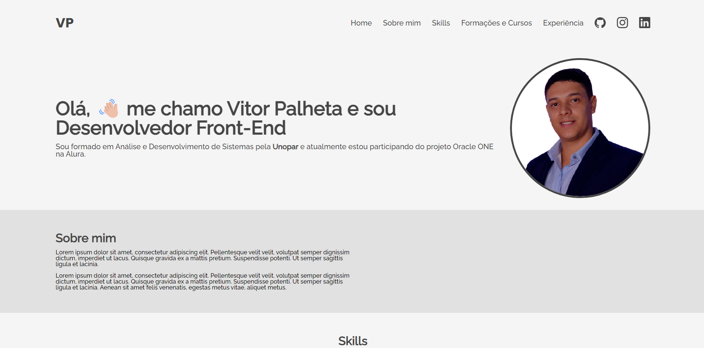

# Challenge ONE | Front End - Portfólio
---

     

###  Primeiros Passos:
---

Olá, me chamo Vitor Palheta e neste reposítório você encontrará o meu primeiro modelo de portfólio desenvolvido no curso da Alura. Um projeto inicial bem simples para aprender alguns conceitos de HTML5, CSS e JS.

### Skills utilizadas!
---

--Html5
--CSS
--JS
